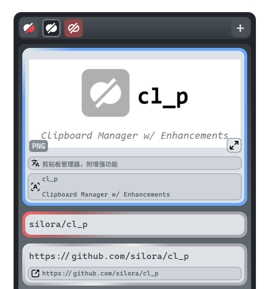
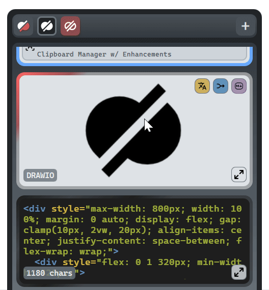
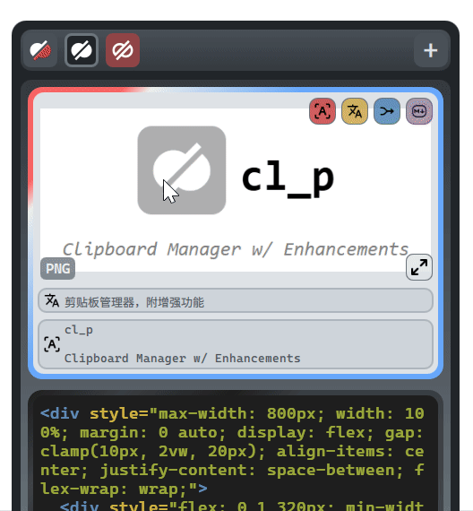
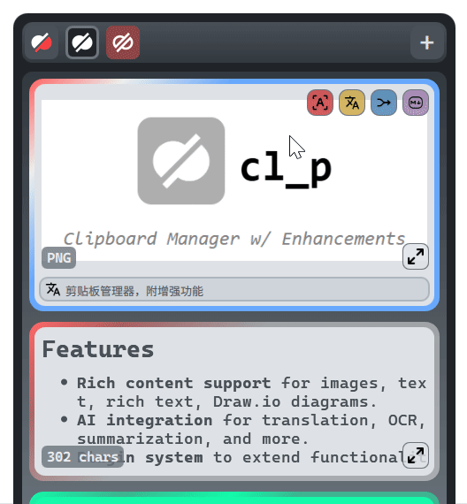
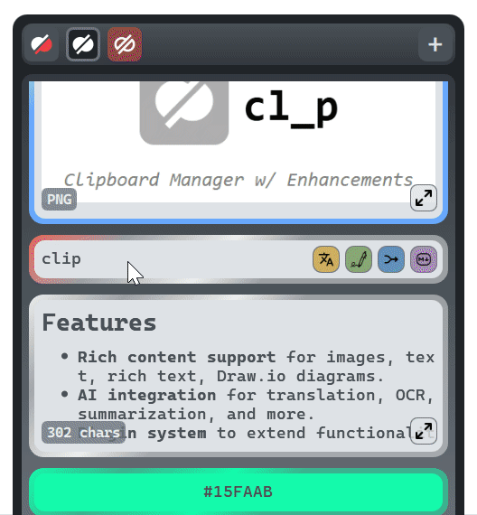

# `cl_p`

Clipboard Manager w/ Enhancements

---

## 
Features

  

- **Capture everything**: text, images, rich text, and Draw.io diagrams stay faithful to the source.
- **Find fast**: quick search plus filters keep deep histories usable.
- **Stay organized**: pin must-keep clips and group related items.
- **Do more with AI**: translate, OCR, summarize, and run custom operations on any clip type.
- **Extend it**: plugin system for bespoke workflows and integrations.

### Global Shortcut
- Open the main window with `Alt + V`.

---

## Items

| Expand preview | Context menu | AI operations |
| --- | --- | --- |
| **Hold left click** to expand long text or large images; **hover edges** to scroll long text. | **Easy context menu option** for HTML, color, or image item conversion. | **AI operations** convert different clipboard content types intelligently. |
|  |  |  |

- Automatically extract URL / file path from text clips for easy redirect.
- Pin important clips to the top for quick access.

### Available mouse actions
- `Hold left click`: expand preview.
    - `Hover edges` (while holding left click): scroll long text clips.
- `Double left click`: paste clip into the active application.
- `Right click`: open context menu for more options.

#### For subitems (returns from AI operations, automatic extractions):
- `Hover`: show full clip in tooltip.
- `Double left click`: paste subitem into the active application.
- `Long left click`: promote subitem to an independent clip.
- `Long right click`: delete subitem.

### Shortcuts
- toggle search bar with `Ctrl + F`.

---

## Groups

- **Group related clips**: create, rename, delete, and manage groups.
- **Drag and drop**: easily reorder groups.
- **Custom destinations**: set where new clips should go.

### Available mouse actions
- `Left click`: select group.
- `Double left click`: select group and set as destination for new clips.
- `Right click`: open group context menu for more options.
- `Drag and drop`: reorder groups.

---

## Plugins

  

- **Easily extendable**: create custom plugins to add new features or integrations.
- **Default plugins**: examples include dictionary lookup, color picker and current time insertion.

